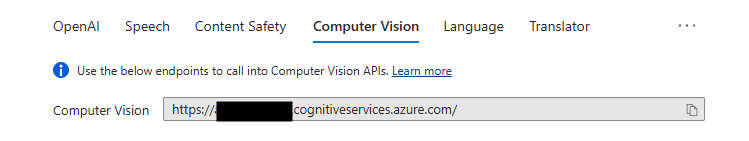
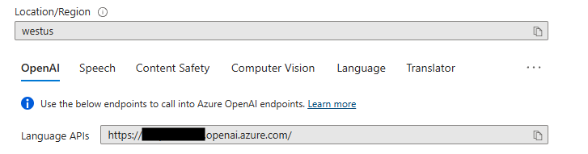
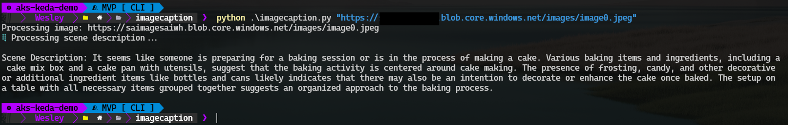

# Image Captioning Script

This script generates dense captions for an image using Azure Cognitive Services and processes the scene description based on the generated captions.


## Prerequisites

- Python 3.6 or higher
- Required Python packages: `requests`, `argparse`, `json`, `prompty[azure]`, `dataclasses`, `typing`, `halo`

You can install the required packages using pip:
```sh
pip install requests argparse json prompty[azure] dataclasses typing halo
```

- Visual Studio Code Prompty Extension: https://marketplace.visualstudio.com/items?itemName=ms-toolsai.prompty

- Azure OpenAI Service 
- GPT4 model deployed

**Deployment Steps for Azure OpenAI Service and GPT-4 Model**

1. **Create a Resource**: Navigate to the Azure portal and create a new resource. Search for "Azure OpenAI" and create a new Azure OpenAI resource.
2. **Set Up the Resource**: Fill in the required details such as resource group, region, and name. Review and create the resource.
3. **Obtain API Key and Endpoint**: Once the resource is created, go to the resource's "Keys and Endpoint" section to get your API key and endpoint URL.

### Deploy GPT-4 Model
1. **Navigate to the Azure OpenAI Resource**: Go to the Azure portal and navigate to the Azure OpenAI resource you created.
2. **Deploy a Model**: In the resource menu, select "Deployments" and then click on "Create".
3. **Select GPT-4**: Choose the GPT-4 model from the list of available models.
4. **Configure Deployment**: Provide a name for the deployment and configure any additional settings as needed.
5. **Deploy**: Click on "Create" to deploy the GPT-4 model. The deployment process may take a few minutes.

Once the deployment is complete, you can use the endpoint and API key to interact with the GPT-4 model in your script.

**Script Setup**
Azure Cognitive Services: You need an Azure Cognitive Services account. Set up your endpoint and API key in the script.

Configuration: Update the following variables in imagecaption.py with your Azure Cognitive Services details. You can find these by navigating to your Azure Open AI Service, they should be visible on the "overview" tab. Ensure you copy the endpoint for the **Computer Vision API**:



```Python
CognitiveServicesEndpoint = "YourCognitiveServiceEndPoint"
CognitiveServiceEndpointKey = "CognitiveServiceEndPointKey"
```

**Configuration for Prompty**

Update the `imagecaption.prompty` file with your Azure OpenAI details. You can find these by navigating to your Azure Open AI Service, they should be visible on the "overview" tab. Ensure you copy the endpoint for the **Language API**:



```yaml
model:
    api: chat
    configuration:
        type: azure_openai
        azure_endpoint: <YourAzureOpenAILanguageEndpoint>
        azure_deployment: gpt-4
        api_version: 2024-02-15-preview
        api_key: <"YourAzureOpenAIKey">
```
**Usage**
To run the script, use the following command:
```sh
python [image_url]
```
- image_url: The URL of the image you want to analyze. If not provided a default URL will be used.

Example
```sh
python https://example.com/image.jpg
```

**How It Works**
_Generate Dense Captions_: The script sends a request to the Azure Cognitive Services endpoint to generate dense captions for the provided image URL.
_Process Scene Description_: The generated captions are then processed to describe the scene.

**Main Functions**
- DenseCaption.generate_dense_caption(image_url: str): Generates dense captions for the given image URL.
- SceneDescriptionAssistant.run(question: any) -> str: Processes the scene description based on the generated captions and leverages prompty to do so.

***Example Output***
```sh
Processing image: https://example.com/image.jpg
Generating dense captions...
Scene Description: A person is holding a frying pan and cooking food on a stove.
```




